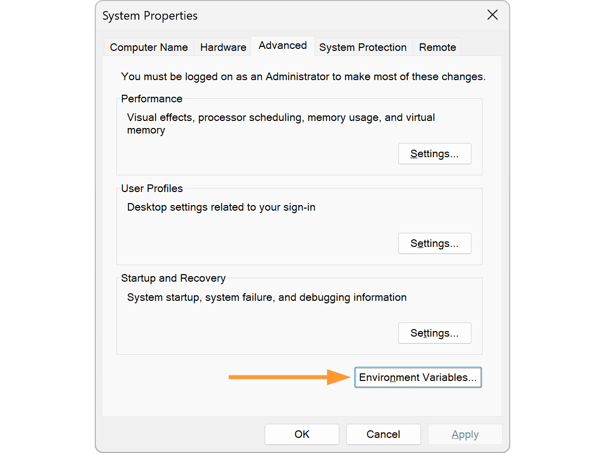

If you have multiple JDKs installed on your machine, you may follow the following instruction to set the default JDK to JDK 11.

### MacOS

1. In terminal, check available java versions on your machine using `/usr/libexec/java_home -V`. For example, I have JDK 21 and 11 on my Mac, and the output is:

```
Matching Java Virtual Machines (2):
    21.0.1 (x86_64) "Eclipse Adoptium" - "OpenJDK 21.0.1" /Library/Java/JavaVirtualMachines/temurin-21.jdk/Contents/Home
    11.0.20.1 (x86_64) "Eclipse Adoptium" - "OpenJDK 11.0.20.1" /Library/Java/JavaVirtualMachines/temurin-11.jdk/Contents/Home
/Library/Java/JavaVirtualMachines/temurin-21.jdk/Contents/Home
```

2. Add the following line to your `~/.bash_profile` (you may use `vim ~/.bash_profile` to open a text editor):

```
export JAVA_HOME=$(/usr/libexec/java_home -v11)
```

If you do not have `~/.bash_profile` file yet, run command `touch ~/.bash_profile` to create this file first.

3. Restart your terminal to check if your java version is correct by `java --version`

### Windows

1. Go to your system setting and check your **Environment Variables**

****

1. Select `Path` in `System Variable`, and click `Edit...`

2. You will probably see multiple path related to jdk but with versions. You may just keep the one with jdk-11 and simply delete other versions (**warning**: only delete jdk related path)