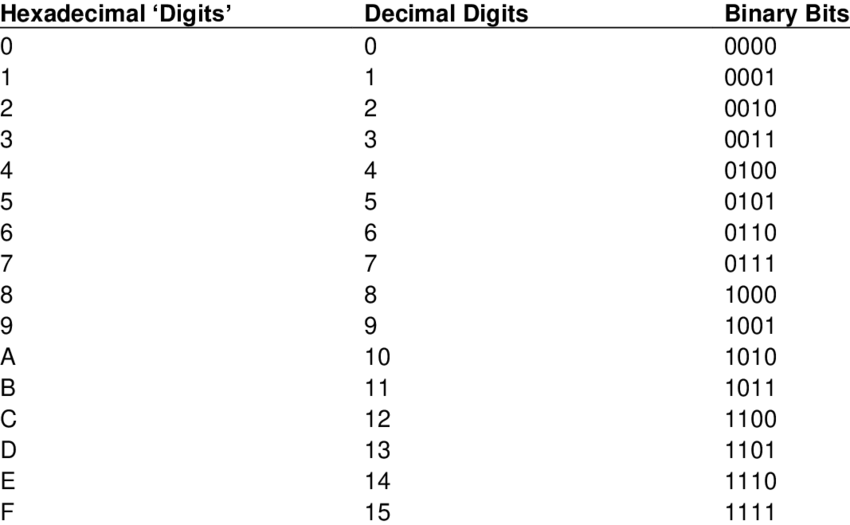

# Stream

Often, you want to do I/O without paying attention to where you are reading from or writing to. You can read from or write to a file, the console, a network connection, or a peripheral device. You must establish such I/O channels in their own specific ways. Once a connection is established you have a stream, and you can polymorphically read from or write to a stream.

## Input Stream (Abstract)

An Inputstream reads (from somewhere) one byte at a time.

```java
public abstract int read() throws IOException
```

reads and return a byte of data. It returns -1 if the end of the stream is reached.

```java
public void close() throws IOException
```

closes the stream and releases any system resources associated with the stream.

## Output Stream (Abstract)

An Outputstream writes (to somewhere) one byte at a time.

```java
public abstract void write(int b) throws IOException
```

writes a byte of data.

```java
public void close() throws IOException
```

closes the stream and releases any system resources associated with the stream.

## FileInputStream and FileOutputStream

FileInputStream reads bytes from a file and FileOutputStream writes bytes to a file.

```java
InputStream in;
OutputStream out;
in = new FileInputStream("filename1"); 
out = new FileOutputStream("filename2"); 
while (true) {
    int nextByte = in.read(); 
    if (nextByte == -1)
        break;
    out.write((char) nextByte);
} 
in.close();
out.close();
```

# Character Encoding

**Unicode** provides a comprehensive character set that includes virtually every character from every written language, aiming for universal text representation.

**ASCII** is an older, limited character encoding that is a subset of Unicode, representing basic English letters and control characters.

**UTF-8** and **UTF-16** are encoding schemes that translate Unicode's universal character set into byte sequences for storage and transmission.

## UTF-8

UTF-8 (8-bit Unicode Transformation Format) is a widely used encoding scheme that encodes each Unicode character as a sequence of one to four bytes.

- **1-byte characters**: The first 128 characters (U+0000 to U+007F), which correspond to the standard ASCII set, are encoded in a single byte. This makes UTF-8 fully backward compatible with ASCII. Format: 0xxxxxxx
    
- **2-byte characters**: Characters from U+0080 to U+07FF, including characters from many Latin-based and other alphabets, are encoded in two bytes. Format:110xxxxx 10xxxxxx
    
- **3-byte characters**: Characters from U+0800 to U+FFFF, which include characters from almost all modern scripts and symbols, are encoded in three bytes. Format:1110xxxx 10xxxxxx 10xxxxxx
    
- **4-byte characters**: Characters from U+10000 to U+10FFFF, which cover rare and historical scripts as well as emojis and other symbols, are encoded in four bytes. Format:11110xxx 10xxxxxx 10xxxxxx 10xxxxxx
    

Based on the above rules, one should be able to figure out the translation between code points and byte representations

## UTF-16

UTF-16 (16-bit Unicode Transformation Format) is a character encoding for Unicode that uses 16 bits (or two bytes) for each character. Most characters from the Basic Multilingual Plane (BMP), which includes most characters in use today, are represented in 16 bits. Characters outside the BMP, known as supplementary characters, are encoded using pairs of 16-bit codes, called surrogate pairs.

- For the characters requiring 1 char, the char can be correctly initialized using the code point.
- The characters requiring 2 chars are called "supplementary characters". A pair of chars representing a supplementary character is called a "surrogate pair".

```Java
public class Utf16Example {
    public static void main(String[] args) {
        // A character in the BMP
        char bmpChar = 'A'; // U+0041
        System.out.println("BMP Character: " + bmpChar);

        // A character outside the BMP represented using surrogate pairs in Java
        String surrogatePair = "\uD83D\uDE00"; // U+1F600 (😀)
        System.out.println("Character with Surrogate Pair: " + surrogatePair);
    }
}
```

The conversion between surrogate pair and code points follows some formula. We won't talk about this for this class. But one may make use of methods, like `charAt` to get the surrogate pair of a supplementary character.

## Mapping Table between Binary, Decimal and Hexdecimal

