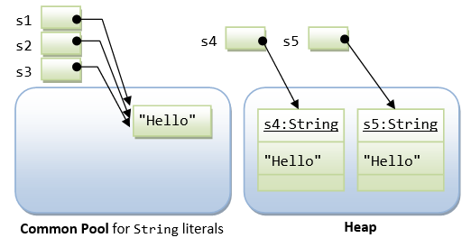

# Objects in Java

Recap: when an object is created in Java, the return value is always a reference pointing to that object, and the **object is always stored in heap**. The reference address can be either stored in stack or heap.

**Warm-up exercise:** If all references have a size of 8 bytes, how much memory space will the following code take to store data?

```
int[] arr = new int[8];
```

```
double[] arr = new double[8];
```

```Java
int[][] arr_2D = new int[2][];
arr_2D[0] = new int[4];
arr_2D[1] = new int[8];
```

# String

**String is really special!**

Strings receive *special treatment* in Java, because they are used frequently in a program. Hence, efficiency (in terms of computation and storage) is crucial. For performance reason, Java's `String` is designed to be in between a primitive and an object.

A `String` can be constructed by either

- directly assigning a string *literal* to a `String` reference - *just like a primitive*, or
- via the "`new`" operator and constructor, similar to any other classes.

For example,

```
String str1 = "Java is Hot";           // construction via string literal
String str2 = new String("Java is Awesome");  // construction via new method
```

In the first statement, `str1` is declared as a `String` reference and initialized with a string literal `"Java is Hot"`. In the second statement, `str2` is declared as a `String` reference and initialized via the `new` operator and constructor to contain `"Java is Awesome"`.

## String Literal vs. String Object

As mentioned, there are two ways to construct a string: implicit construction by assigning a string literal or explicitly creating a `String` object via the `new` operator and constructor. For example,

```
String s1 = "Hello";              // String literal
String s2 = "Hello";              // String literal
String s3 = s1;                   // same reference
String s4 = new String("Hello");  // String object
String s5 = new String("Hello");  // String object
```



Java has provided a special mechanism for keeping the `String` literals - in a so-called *string common pool*. If two string literals have the same contents, they will share the same storage inside the common pool. This approach is adopted to *conserve storage* for frequently-used strings. On the other hand, `String` objects created via the `new` operator and constructor are kept in the heap. Each `String` object in the heap has its own storage just like any other object.

You can use the method `equals()` of the `String` class to compare the contents of two `String`s. You can use the relational equality operator `'=='` to compare the references (or pointers) of two objects.

```Java
String s0 = "s";
String s1 = "s";
String s2 = new String("s");
System.out.println(s0 == s1); // true, compare reference
System.out.println(s0 == "s"); // true, compare content
System.out.println("s" == "s"); // true, compare content
System.out.println(s0 == s2); // false, compare reference
System.out.println("te" + "st" == "t" + "est") // true, compare reference
System.out.println(88 + "8" + 88 == 888 + "8" + 8) // true or false?
System.out.println(88 + 88 + "8" == 888 + "8" + 8) // true or false?
```

### Exercises

**Ex 1.** What is the output of the following snippet?

Draw the memory diagram of the references and the objects as well

```
import java.util.*;
public class App {
    public static void main(String[] args) {
        String[] arr1 = {"one", "two", "three"};
        String[] arr2 = {"four", "five", "six"};
        
        modifyArray(arr1, arr2);
        
        System.out.println("Array 1: " + Arrays.toString(arr1));
        System.out.println("Array 2: " + Arrays.toString(arr2));
    }
    
    public static void modifyArray(String[] a, String[] b) {
        a = new String[3];
        a[0] = "seven";
        a[1] = "eight";
        a[2] = "nine";
        
        b[0] = "ten";
        b[1] = "eleven";
        b[2] = "twelve";
    }
}
```

**Ex 2.** What is the output of the following snippet?

Draw the memory diagram of the references and the objects as well

```
import java.util.*;
public class App {
    public static void main(String[] args) {
        String s = "Hello";
        char[] c = {'H', 'e', 'l', 'l', 'o'};
        
        modifyString(s);
        modifyArray(c);
        
        System.out.println("String: " + s);
        System.out.println("Array: " + Arrays.toString(c));
    }
    
    public static void modifyString(String str) {
        str = "World";
    }
    
    public static void modifyArray(char[] arr) {
        arr[0] = 'W';
        arr[3] = 'd';
    }
}
```

### Hint for firstPrimes
```
// last time, i said you only need to check if N is divisible by some number withinn 2 to square root of N
// acutually, if a is divisible by b, then a is divisible by some prime factor of b
// for example, 18 / 6, the prime factors of 6 are 2, 3, this means 18 is also divisible by 2,3
// insipred by them, we actually dont have to check all the numbers from 2 to square root of N
// instead, we can only check prime numbers from 2 to square root of N
// for exmple, 36, we only need to check if 36 can be divided by 2,3,6
// you dont have to check all the numbers from 2 to 6
```